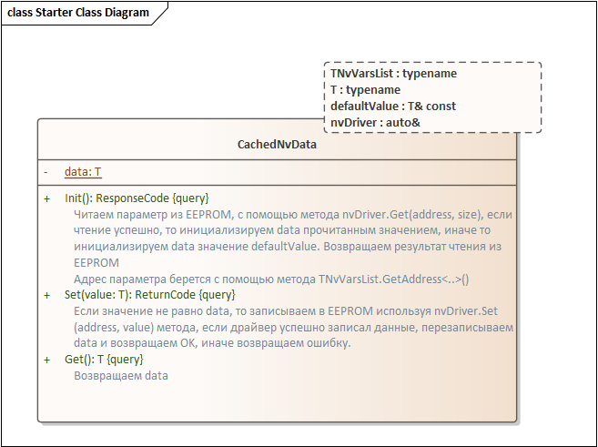
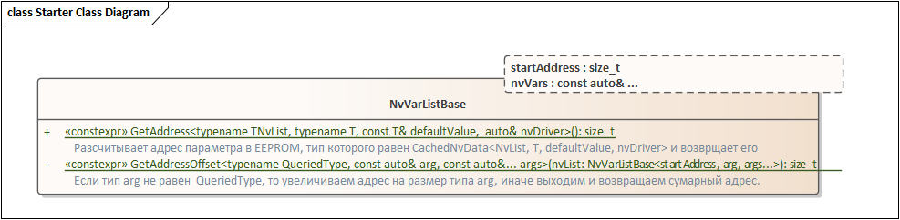

## Введение

Смотря на то, как студенты делают свои курсовые, я стараюсь замечать моменты, которые вызывают затруднения у них. Одним из таких моментов является работа с внешним EEPROM. Там где хранятся необходимые пользовательские переменные для всяких настроек. 

Всякий раз когда студент решает что-то там сохранить, это выливается в множество багов, связанных как с неверно выбранной архитектурой, так и просто человеческим фактором. Собственно обычно студент лезет в интернет и находит что-то типа этого:

 ```cpp
int address = 0;
float val1 = 123.456f;
byte val2 = 64;
char name[10] = "Arduino";

EEPROM.put(address, val1);
address += sizeof(val1); //+4
EEPROM.put(address, val2);
address += sizeof(val2); //+1
EEPROM.put(address, name);
address += sizeof(name); //+10
 ```


Этот замечательный код, который лапшой разрастается по всему проекту, потому что обычно мы имеем около 100 разных параметров в EEPROM памяти, немудрено, что где-то да и допустит торопливый студент ошибку.

Кроме того, обычно студенты используют РТОС, а потому нужно понимать, что обращение к EEPROM из разных потоков может либо к фейлам, либо ко всяким там дедлокам. Поэтому если студент использует EEPROM, я вначале прошу мне нарисовать дизайн, чтобы показать как он собирается с ней работать. 

Обычно все сводится к двум вариантам:
* Доступ к EEPROM только из одного места. Типа такой NvManager задачи, проходится по списку закешеруемых NV пользовательских параметров и смотрит, было ли в них изменение, и если да - пишет в EEPROM. 
 Тут очень большой и толстый плюс:
   Не нужно блокировать работу с EEPROM, все делается в одном месте. Все просто, параметр изменился, берем и пишем. 
 
Но есть и минусы:
обычно запись таких параметров происходит, когда пользователь что-то послал через внешний интерфейс, скажем Modbus протокол, ну типа он говорит, что я тут записал новые единицы измерения. Ок отвечает ему программа, я их закешировала, но на самом деле запись то еще не прошла. И пройдет позже, а ответить пользователю нужно прямо сейчас. И вот пользователь получает ответ, что все хорошо, новые единицы установлены, но вдруг во время отложенной записи происходит сбой и реальные единицы на самом деле не записались. В итоге устройство как бы обмануло пользователя. Понятно, что устройство должно выставить ошибку и как-то об этом сообщить в своем статусе, но все же, пользователь уже немного с недоверием начинает смотреть на ваше устройство. 

* Второй способ - пишем сразу  
Тут пользователь всегда получает достоверный ответ. Мы не задумываясь пишет параметр в EEPROM там где на надо, и это выглядит просто  

Тут возможно проблема с быстрыми протоколами, когда ответить нам нужно в течении ограниченного времени, скажем 5 мс, а те кто работал с EEPROM знают, что записывается там все постранично, ну точнее, чтобы записать один байт, EEPROM, копирует целую страницу во внешний буфер, меняет в буфере этот один байт, стирает страницу, и затем записывает буфер (ну т.е. всю страницу) и того на запись одной страницы сразу тратится от 5 до 10 мс, в зависимости от размера страницы.   

Ну и соотвественно проблема блокировки, так как мы можем писать хоть что, хоть откуда, скажем журнал ощибок из разных подсистем из разных задач и от пользователя и так далее...


Но в обоих этих способах, мы хотим, чтобы доступ к параметрам не был похож, на тот код с Ардуино, что я привел, а был простым и понятным, в идеале, чтобы было вообще так:

 ```cpp
 myEEPROMData = 10.0F; //Записываем 10.0F в EEPROM по адресу, где лежит мой myEEPROMData параметр
 ```

Так как мы понимаем, что запись в EEPROM может не удастся, то вместо такого примера я хочу показать, как можно сделать вот так:
 ```cpp
//Записываем в EEPROM строку из 5 символов по адресу параметра myStrData
  auto returnStatus = myStrData.Set(tStr6{"Hello"}); 
  if (returnStatus)
  {
  	std::cout << "Ok"
  }
  //Записываем в EEPROM float параметр по адресу параметра myFloatData
  returnStatus = myFloatData.Set(37.2F); 
  returnStatus = myUint32Data.Set(0x30313233);
```

### Анализ требований и дизайн
Итак, понятно, что мы хотим получить, но давайте более детально сформируем требования
* Каждая наша переменная(параметр) должна иметь уникальный адрес в EEPROM
** Мы не хотим руками задавать этот адрес, он должен высчитываться сам, на этапе компиляции, потому что мы не хотим, чтобы студент нечаянно задал неверный адрес и сбил все настройки
* Мы не хотим постоянно лазить в EEPROM, когда пользователь хочет прочитать параметр
** Обычно EEPROM подключается через I2C и SPI, передача данных по этим интерфейсам тоже отнимает время, поэтому лучше кэшировать параметры в ОЗУ, и возвращать сразу копию из кеша.
* При инициализации параметра, если не удалось прочитать данные с EEPROM, мы должны вернуть какое-то значение по умолчанию.
* На плате могут быть несколько EEPROM, а может вообще и не EEPROM, а скажем второй процессор, где хранятся разные данные, поэтому мы должны предусмотреть, возможность того, чтобы параметр мог использовать заданный драйвер для записи в нужное место.
   
* Все должно быть дружелюбным простым и понятным:)

Итак, давайте прикинем дизайн класса, который будет описывать такой параметр и удовлетворять нашим требованиям:
Назовем класс CashedNvData

####CashedNvData



Вообще все должно быть понятно из картинки, но на всякий случай:
При создании объекта типа CachedNvData мы должны полезть в EEPROM и считать оттуда нужный параметр с нужного адреса. Адрес будет высчитываться на этапе компиляции, пока эту магию пропустим.
Прочитанное значение хранится в data, и как только кому-то понадобится, оно возвращается немедленно из копии в ОЗУ с помощью метода Get().
А при записи, мы уже будем работать с EEPROM через nvDriver. Можно подсунуть любой nVDriver, главное, чтобы у него был метод Set() и Get(). Вот например, такой вот драйвер подойдет.


Остался еще один штрих, придумать, как же формировать автоматически адрес, каждого параметра. Для того, чтобы адрес высчитывался автоматически, необходимо, чтобы все параметры для EEPROM были зарегистрированы в каком-нибудь списке. Тогда список может сам посчитать адрес параметра по его положению в списке и собственно вернуть его когда надо.

Вот например, если у нас есть 3 параметра:

```cpp
//Длина параметра 6 байт
constexpr CachedNvData<NvVarList, tString6, myStrDefaultValue,  nvDriver> myStrData;
//Длина параметра 4 байта
constexpr CachedNvData<NvVarList, float, myFloatDataDefaultValue, nvDriver> myFloatData;
//Длина параметра 4 байт
constexpr CachedNvData<NvVarList, std::uint32_t, myUint32DefaultValue,  nvDriver> myUint32Data; 
```
То когда мы сделали бы какой-то вот такой список:
```cpp
NvVarList<100U, myStrData, myFloatData, myUint32Data>
```
У нас бы у myStarData был бы адреc 100, у myFloatData -  106, а у myUint32Data - 110. Ну и соответственно список мог бы его вернуть для каждого из параметра.

Собственно нужно чтобы этому списку передавался начальный адрес, и список параметров в NV. Также нужно чтобы у списка был метод GetAdress(), который возвращал бы адрес нужного параметра. Идея этого метода в том, чтобы найти в списке тип равный типу самого параметра, и по номеру этого элемента автоматически рассчитать адрес. Важно, чтобы типы всех параметров были разные, это добивается тем, что ссылка на значение по умолчанию должны быть разная для каждого параметра.

Сделаем такой базовый класс, назовем его NvVarListBase:



### Код
А теперь самая простая часть - пишем код

#### CashedNvData
```cpp
template<typename NvList, typename T, const T& defaultValue, const auto& nvDriver>
class CaсhedNvData
{
  public:
    ReturnCode Set(T value) const
    {
      //Ищем адрес EEPROM параметра в списке 
      constexpr auto address = NvList::template GetAddress<NvList,T,defaultValue,nvDriver>();
      //Записываем новое значение в EEPROM
      ReturnCode returnCode = nvDriver.Set(address,reinterpret_cast<const tNvData*>(&value), sizeof(T));
      //Если значение записалось успешно, обновляем копию в ОЗУ
      if (!returnCode)
      {
        memcpy((void*)&data, (void*)&value, sizeof(T));
      }
      return returnCode;
    }

    ReturnCode Init() const
    {
      constexpr auto address = NvList::template GetAddress<NvList,T,defaultValue,nvDriver>();
      //Читаем значение из EEPROM
      ReturnCode returnCode = nvDriver.Get(address, reinterpret_cast<tNvData*>(&data), sizeof(T));
      //Tесли значение не прочиталось из EEPROM, устанавливаем значение по умолчанию
      if (returnCode)
      {
        data = defaultValue;
      }
      return returnCode;
    }

    T Get() const
    {
      return data;
    }
    
    using Type = T;
  private:
    inline static T data = defaultValue;
};
```

#### NvVarListBase
```cpp
template<const tNvAddress startAddress, const auto& ...nvVars>
struct NvVarListBase
{    
    template<typename NvList, typename T, const T& defaultValue, const auto& nvDriver>
    constexpr static size_t GetAddress()
    {       
      //Ищем EEPROM адрес параметра с типом CaсhedNvData<NvList, T, defaultValue, nvDriver>
      return startAddress + GetAddressOffset<CaсhedNvData<NvList, T, defaultValue, nvDriver>>(NvVarListBase<startAddress,nvVars...>());
    }
    
  private:
	
   template <typename QueriedType, const auto& arg, const auto&... args>    
   constexpr static size_t GetAddressOffset(NvVarListBase<startAddress, arg, args...>)
   {
   	//Чтобы узнать тип первого аргумента в списке, создаем объект такого же типа как и первый аргумент
    auto test = arg;
    //если тип созданного объекта такой же как и искомый, то заканчиваем итерации
    if constexpr (std::is_same<decltype(test), QueriedType>::value)
    {
        return  0U;
    } else
    {
        //Иначе увеличиваем адрес на размер типа параметра и переходим к следующему параметру в списке.
    	return sizeof(typename decltype(test)::Type) + GetAddressOffset<QueriedType>(NvVarListBase<startAddress, args...>()) ;
    }
  }    
};
```
#### Объявление переменных в EEPROM

Задаем начальные значения параметров

```cpp
using tString6 = std::array<char, 6U>;

inline constexpr float myFloatDataDefaultValue = 10.0f;
inline constexpr tString6 myStrDefaultValue = {"Habr "};
inline constexpr std::uint32_t myUint32DefaultValue = 0x30313233;
```

Задаем сами параметры

```cpp
//поскольку список ссылается на параметры, а параметры на список. Используем forward declaration
struct NvVarList;   
constexpr NvDriver nvDriver;
//Теперь можем использовать NvVarList в шаблоне EEPROM параметров
constexpr CaсhedNvData<NvVarList, float, myFloatDataDefaultValue, nvDriver> myFloatData;
constexpr CaсhedNvData<NvVarList, tString6, myStrDefaultValue,  nvDriver> myStrData;
constexpr CaсhedNvData<NvVarList, std::uint32_t, myUint32DefaultValue,  nvDriver> myUint32Data;
```

Теперь осталось определить сам список параметров, важно, чтобы все EEPROM параметры были разных типов. Можно впринципе вставить статическую проверку на это в NvVarListBase.
```cpp
struct NvVarList : public NvVarListBase<0, myStrData, myFloatData, myUint32Data>
{
};
```

А теперь можем использовать наши параметры хоть где, 

```cpp
struct NvVarList;
constexpr NvDriver nvDriver;
using tString6 = std::array<char, 6U>;

inline constexpr float myFloatDataDefaultValue = 10.0f;
inline constexpr tString6 myStrDefaultValue = {"Habr "};
inline constexpr std::uint32_t myUint32DefaultValue = 0x30313233;

constexpr CaсhedNvData<NvVarList, float, myFloatDataDefaultValue, nvDriver> myFloatData;
constexpr CaсhedNvData<NvVarList, tString6, myStrDefaultValue,  nvDriver> myStrData;
constexpr CaсhedNvData<NvVarList, std::uint32_t, myUint32DefaultValue,  nvDriver> myUint32Data;

struct NvVarList : public NvVarListBase<0, myStrData, myFloatData, myUint32Data>
{
};

int main()
{    
    myStrData.Init();
    myFloatData.Init();
    myUint32Data.Init()
    
    myStrData.Get();
    returnCode = myStrData.Set(tString6{"Hello"});
    if (!returnCode)
    {
        std::cout << "Hello has been written" << std::endl;
    }
    myStrData.Get();
    myFloatData.Set(37.2F);    
    myUint32Data.Set(0x30313233);    
    return 1;
}
```

Можно передавать ссылку на них в любой класс, через конструктор или шаблон. 

```cpp
template<const auto& param>
struct SuperSubsystem
{
  void SomeMethod()
  {
    std::cout << "SuperSubsystem read param" << param.Get() << std::endl; 
  }
};
```

```cpp
int main()
{    
  SuperSubsystem<myFloatData> superSystem;
  superSystem.SomeMethod();
}
```

В общем теперь студенты могут работать с EEPROM более юзерфрендли и допускать меньше ошибок, ведь часть проверок за них сделает компилятор.