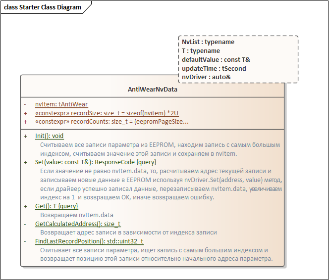
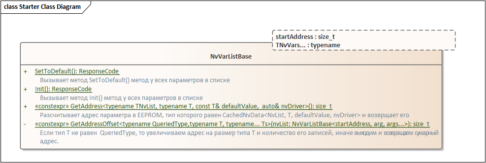
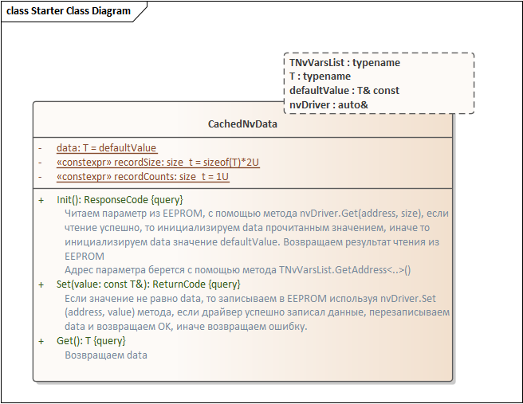
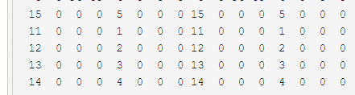

== Введение

Доброго времени суток. Прошлая моя статья про параметры в EEPROM была, мягко говоря, немного недопонята.
Видимо, я как-то криво описал цель и задачу которая решалась. Постараюсь в этот раз исправиться, описать более подробно суть решаемой проблемы и в этот раз расширим границы задачи.

А именно поговорим о том, как хранить параметры, которые необходимо писать в EEPROM постоянно. Многим может показаться, что это очень специфическая проблема, но на самом деле множество устройств именно этим и занимаются - постоянно пишут в EEPROM. Счетчик воды, тепловычислитель, одометр, да просто любое устройство, которое хранит время своей работы, всяческие журналы действий пользователя и журналы, хранящие историю измерений.

Особенность таких параметров заключается в том, что их нельзя писать просто так в одно и то же место EEPROM, вы просто израсходуете все циклы записи EEPROM. Например, если, необходимо писать время работы один раз в 1 минуту, то нетрудно посчитать, что с EEPROM в 1 000 000 циклов записей, вы загубите его меньше чем за 2 года. А что такое 2 года, если обычное измерительное устройство имеет время поверки 3 и даже 5 лет.

Кроме того, не все EEPROM имеют 1 000 000 циклов записей, многие дешевые EEPROM все еще производятся по старым технологиям с количеством записей 100 000. А если учесть, что 1 000 000 циклов указывается только при идеальных условиях, а скажем при высоких температурах это число может снизиться вдвое, то ваша EEPROM может оказаться самым ненадежным элементом уже в первый год работы устройства.

Поэтому давайте попробуем решить эту проблему, и сделать так, чтобы обращение к параметрам было столь же простым как в прошлой статье, но при этом EEPROM хватало бы на 30 лет, ну или на 100 (чисто теоретически).

Итак, в прошлой статье, я с трудом показал, как сделать, так, чтобы с параметрами в EEPROM можно было работать интуитивно понятно, не задумываясь, где они лежат и как осуществляется доступ к ним
Напомню:

[source,cpp]
----
ReturnCode returnCode = NvVarList::Init();  //инициализируем все наши параметры из EEPROM
returnCode = myStrData.Set(tString6{ "Hello" }); //Записываем Hello в EEPOM myStrData.
auto test = myStrData.Get();                //Считываем текущее значение параметра 

myFloatData.Set(37.2F);    //Записываем 37.2 в EEPROM.
myUint32Data.Set(0x30313233);

----

Для начала проясню, для чего вообще нужно обращаться по отдельности к каждому параметру, этот момент был упущен в прошлой статье. Спасибо товарищам за пояснение. 

Все очень просто, существует огромный пласт измерительных устройств, кторые использует полевые протоколы такие как HART, FF или PF, где пользовательские команды очень атомарные. Например, в HART протоколе есть отдельные команды - запись единиц изменения, запись верхнего диапазона, запись времени демпфирования, калибровка нуля, запись адрес опроса и т.д. Каждая такая команда должна записать один параметр, при этом успеть подготовить ответ и ответить. Таких параметров может быть до 500 - 600, а в небольших устройствах их около 200.

Если использовать способ, который предложил @HiSER https://habr.com/ru/post/560632/#comment_23109066 - это будет означать, что для перезаписи одного параметра размером в 1 byte, я должен буду переписать всю EEPROM. Если алгоритм контроля целостности подразумевает хранение копии параметров, то для 200 параметров со средней длиной в 4 байта, мне нужно будет переписать 1600 байт EEPROM, а если параметров 500, то и все 4000.

Учитывая, что малопотребляющие устройства или устройства, работающие от токовой петли должны потреблять, ну скажем 3 мА, при этом должно иметь достаточно энергии для питания модема полевого интерфейса, графического индикатора, да еще и BLE в придачу.

Понятно, что необходимо, сделать так, чтобы микроконтроллер ел как можно меньше, самый простой способ, это уменьшить частоту тактирования, скажем до 500 КГц, или 1 000 000 Мгц (Сразу оговорюсь, в надежных применениях использование режима низкого потребления запрещено, поэтому микроконтроллер все время должен работать на одной частоте). На такой частоте, простая передача 4000 байт по SPI займет около 70 мс, прибавим к этому задержку на сохранение данных в страницу (в среднем 7мс на страницу), обратное вычитывание, и вообще обработку запроса микроконтроллером и получим около 3 секунд, на то, чтобы записать один параметр.

Поэтому в таких устройствах лучше чтобы достут к каждому параметру был отдельным, и обращение к ним должно быть индивидуальным. Их можно группировать в структуру по смыслу, или командам пользователя, но лучше, чтобы все они не занимали больше одной страницы, а их адреса были выравнены по границам страницы.

Но вернемся к нашей основной проблеме - мы хотим постоянно писать параметры.

== Как работать с EEPROM, чтобы не износить её

Те кто в курсе, можете пропустить этот раздел. Для остальных краткое, чисто мое пояснение.
Как я уже сказал, число записей в EEPROM ограничено. Это число варьируется от может быть 100 000, а может и 1 000 000. Так как же быть, если я хочу записать параметр 10 000 000 раз?

И здесь мы должны понять, как внутри EEPROM устроен доступ к ячейкам памяти.

Итак, в общем случае вся EEPROM разделена на страницы. Страницы изолированы друг от друга. Страницы могут быть разного размера, для небольших EEPROM это, скажем, 16, 32 или 64 байта. Каждый раз когда вы записываете данные по какому-то адресу, EEPROM копирует все содержимое страницы, в которой находятся эти данные, во внутренний буфер.  Затем меняет данные, которые вы передали в этом буфере и записывает весь буфер обратно. Т.е. по факту, если вы поменяли 1 байт в странице, вы переписываете всю страницу. Но из-за того, что страницы изолированы друг от друга остальные страницы не трогаются.

Таким образом, если вы записали 1 000 000 раз в одну страницу, вы можете перейти на другую страницу и записать туда еще раз 1 000 000 раз, потом в другую и так далее. Т.е. весь алгоритм сводится к тому, чтобы писать параметр не в одну страницу, а каждый раз сдвигаться в следующую страницу. Можно закольцевать эти действия и после 10 раза, например, снова писать в исходную страницу. Таким образом, вы просто отводите под параметр 10 страниц, вместо 1.

Да придется пожертвовать память, но как сделать по другому, я пока не знаю. Если есть какие мысли - пишите в комментариях. 

=== Анализ требований и дизайн

Итак, мы почти поняли что хотим. Но давайте немного формализуем это. Для начала, назовем наши параметры, которые нужно писать постоянно - (AntiWearNvData) данные антиизноса . Мы хотим, чтобы обращение к ним было такое же простое и юзер френдли, как и к кешируемым параметрам из предыдущей статьи.

[source,cpp]
----
ReturnCode returnCode = NvVarList::Init();       //инициализируем все наши параметры из EEPROM
returnCode = myStrData.Set(tString6{ "Hello" }); //Записываем Hello в EEPROM myStrData.
auto test = myStrData.Get();                     //Считываем текущее значение параметра

myFloatData.Set(37.2F);                          //Записываем 37.2 в EEPROM.
myUint32Data.Set(0x30313233);

myFloatAntiWearData.Set(10.0F);                  //Записали в параметр 10.0F в EEPROM первый раз
myFloatAntiWearData.Set(11.0F);
myFloatAntiWearData.Set(12.0F);
myFloatAntiWearData.Set(13.0F);
...
myFloatAntiWearData.Set(11'000'000.0F);    // Записываем этот же параметр в EEPROM 11 000 000 раз.
myUint32AntiWearData.Set(10U);              // Тоже самое с int
myStrAntiWearData.Set(tString6{ "Hello" }); // со строкой и так далее

----

* Пользователь должен задать параметры EEPROM и время обновления параметр
** На этапе компиляции нужно посчитать количество необходимых страниц (записей), чтобы уложиться в необходимое время работы EEPROM. Для этого нужно знать:
*** Количество циклов перезаписи
*** Размер страницы
*** Время обновления параметра
*** Время жизни устройства
+
Хотя конечно, можно было дать возможность пользователю самому задавать количество записей, но что-то я хочу, чтобы все считалось само  на этапе копмиляции.

* Каждая наша переменная(параметр) должна иметь уникальный начальный адрес в EEPROM
** Мы не хотим сами руками задавать адрес, он должен высчитываться на этапе компиляции
* При каждой следующей записи, адрес параметра должен изменяться, так, чтобы данные не писались по одному и тому же адресу
** Это также должно делаться автоматически, но уже в runtime, никаких  дополнительных действий в пользовательском коде мы делать не хотим.

* Мы не хотим постоянно лазить в EEPROM, когда пользователь хочет прочитать параметр
 ** Обычно EEPROM подключается через I2C и SPI, передача данных по этим интерфейсам тоже отнимает время, поэтому лучше кэшировать параметры в ОЗУ, и возвращать сразу копию из кеша.
 ** При инициализации мы должны найти самую последнюю запись, её считать и закешировать.
* За целостность должен отвечать драйвер.
** За алгоритм проверки целостности отвечает драйвер, если при чтении он обнаружил несоответствие он должен вернуть ошибку. В нашем случае, пусть в качестве алгоритма целостности будет простое хранение копии параметра. Сам драйвер описывать не буду, но приведу пример кода.

Ну кажется это все наши хотелки. Как и в прошлой статье давайте прикинем дизайн класса, который будет описывать такой параметр и удовлетворять нашим требованиям:
Назовем класс AntiWearNvData и собственно он будет похож на, CachedNvData из прошлой статьи. Но с небольшими изменениям. При каждой записи в EEPROM, нам нужно постоянно сдвигать адрес записи, поэтому необходимо хранить индекс, который будет указывать на номер текущей записи. Этот индекс должен записываться в EEPROM вместе с параметром, чтобы после инициализации можно было найти запись с самым большим индексом - эта запись и будет самой актуальной. Индекс можно сделать uint32_t точно хватит на 30 лет - даже при 100 000 циклах записи.

И вот наш класс:

#### Пользователь должен задать параметры EEPROM и время обновления параметр
В отличии от CachedNvData Из предыдущей статьи здесь появился параметр updateTime. На основе этого параметра можно посчитать сколько записей необходимо для того, чтобы уложиться в ожидаемое время жизни EEPROM. Сами параметры EEPROM можно задать в отдельном заголовчнике. Например, так:

[source,cpp]
----
using tSeconds = std::uint32_t;

constexpr std::uint32_t eepromWriteCycles = 1'000'000U;
constexpr std::uint32_t eepromPageSize = 32U;
// Хотим чтобы EEPROM жила 10 лет
constexpr tSeconds eepromLifeTime = 3600U * 24U * 365U * 10U;
----
Вообще можно было бы обойтись и без updateTime. И для каждого параметра задавать необходимое количество самим. Но я решил, все переложить на компилятор, потому что самому считать лень. В итоге сам расчет необходимого количества записей, с учетом, что все они выравнены по границам страницы, будет примерно таким:

[source,cpp]
----
template<typename NvList, typename T, const T& defaultValue, tSeconds updateTime, auto& nvDriver>
class AntiWearNvData
{
  private:
      struct tAntiWear
      {
         T data = defaultValue;
          std::uint32_t index = 0U;
      };
      inline static tAntiWear nvItem;

  public:
      static constexpr auto recordSize = sizeof(nvItem) * 2U;
      // преполагаем, что параметр не занимает больше страницы и
      // все они выравнены по границам страцницы, но ничто не запрещает
      // сделать более сложный расчет необходимого количества записей,
      // для параметров, занимающих больше страницы. Для статьи сделал такие ограничения.
      static_assert(eepromPageSize/recordSize != 0, "Too big parameter");
      static constexpr size_t recordCounts =  (eepromPageSize/recordSize) * eepromLifeTime / (eepromWriteCycles * updateTime);
}
----

####  При каждой следующей записи, адрес параметра должен изменяться, так, чтобы данные не писались по одному и тому же адресу

Еще одной особенностью нашего противоизносного параметра является тот факт, что кроме самого значения, мы должны хранить еще и его индекс. Индекс нужен нам для двух вещей:

* По нему мы будет рассчитывать слудующий адрес записи
* Для того, чтобы после выключения/включения датчика найти последнюю запись, считать её и проинициализировать значением по адресу этой записи кеширумое значение в ОЗУ.

Для этого заведена специальная структура tAntiWear. Её то мы и будем сохранять при вызове метода Set(...), который, кроме непосредственно записи, еще сдвигает индекс текущей записи на 1.

[source,cpp]
----
template<typename NvList, typename T, const T& defaultValue, tSeconds updateTime, auto& nvDriver>
class AntiWearNvData
{
 public:
    ReturnCode Set(const T& value) const
    {
        tAntiWear tempData = {.data = value, .index = nvItem.index};
        //На основе текущего индекса расчитывем текущий адрес записи в EEPROM
        const auto calculatedAddress = GetCalculatedAdress(nvItem.index);

        ReturnCode returnCode = nvDriver.Set(calculatedAddress, reinterpret_cast<const tNvData*>(&tempData), sizeof(tAntiWear));

        //Если запись прошла успешно, то обновляем кэшируемую копию параметра, а также смещаем индекс на 1, для следующей записи
        if (!returnCode)
        {
          nvItem.data = value;
          nvItem.index ++;
        }

        return returnCode;
    }
...
};
----

Давайте посмотрим как реализован метод расчета текущего адреса записи:

[source,cpp]
----
template<typename NvList, typename T, const T& defaultValue, tSeconds updateTime, auto& nvDriver>
class AntiWearNvData
{
...
  private:
      static size_t GetCalculatedAdress(std::uint32_t ind)
      {
         constexpr auto startAddress = GetAddress();
         //собственно весь алгоритм расчета сводится к прибавленипю к стартовому адресу
         //смещения текущей записи, которое находится по текущему индексу
         //как только индекс будет кратен расчитанному количеству, необходимо начать писать
         //с начального адреса - такой кольцевой буфер в EEPROM.
         size_t result = startAddress + recordSize * ((ind % recordCounts));
         assert(result < std::size(EEPROM));
         return result;
      }

      constexpr static auto GetAddress()
      {
          return NvList::template GetAddress<const AntiWearNvData<NvList, T, defaultValue, updateTime, nvDriver>>();
      }

};
----

#### Мы не хотим постоянно лазить в EEPROM, когда пользователь хочет прочитать параметр
Метод Get - крайне простой, он просто возвращает копию из ОЗУ

[source,cpp]
----
template<typename NvList, typename T, const T& defaultValue, tSeconds updateTime, auto& nvDriver>
class AntiWearNvData
{
public:
   T Get() const
    {
        return nvItem.data;
    }
};
----

Теперь самое интересное, чтобы проинициализировать копию в ОЗУ правильным значением, необходимо при запуске устройства считать все записи нашего параметра и найти запись с самым большим индексом. Наверняка есть еще разные методы хранения данных, например, связанный список, но использование индекса, показалось мне ну прямо очень простым.

[source,cpp]
----
template<typename NvList, typename T, const T& defaultValue, tSeconds updateTime, auto& nvDriver>
class AntiWearNvData
{
public:
    static ReturnCode Init()
    {
        const auto ind = FindLastRecordPosition();
        constexpr auto startAddress = GetAddress();
        const auto calculatedAddress =  startAddress + recordSize * ind;

        return nvDriver.Get(calculatedAddress, reinterpret_cast<tNvData*>(&nvItem), sizeof(tAntiWear));
    }
...
private:
   static std::uint32_t FindLastRecordPosition()
   {
       // Метод поиска индекса приводить не буду, оставлю на откуп читателям
       // Здесь нужно считать все записи парамтера и найти параметр с самым большим индексом, пока предположим,
       // что запись с самым большим индексом находится на позиции 0 - Там записано число 15 с индексом 5.
       return  0U;
   }
};
----

В общем-то и все класс готов, полный код класса:
[source,cpp]
----
template<typename NvList, typename T, const T& defaultValue, tSeconds updateTime, auto& nvDriver>
class AntiWearNvData
{
 public:
    ReturnCode Set(const T& value) const
    {
        tAntiWear tempData = {.data = value, .index = nvItem.index};
        // К размеру типа прибавляем 4 байта индекса и умножаем на номер индекса записи.
        // Умножаем на 2, чтобы драйвер мог хранить копиию записи для проверки целостности
        const auto calculatedAddress = GetCalculatedAdress(nvItem.index);

        ReturnCode returnCode = nvDriver.Set(calculatedAddress, reinterpret_cast<const tNvData*>(&tempData), sizeof(tAntiWear));
        //  std::cout << "Write at address: " << calculatedAddress << std::endl;
        //Если запись прошла успешно, то обновляем кэшируемую копию параметра, а также смещаем индекс на 1, для следующей записи
        if (!returnCode)
        {
          nvItem.data = value;
          //если колчиство записей превысило нужное количество, обнуляем индекс, начинаем писать с начального адреса
          nvItem.index ++;
        }

        return returnCode;
    }

    static ReturnCode Init()
    {
        const auto ind = FindLastRecordPosition();
        constexpr auto startAddress = GetAddress();
        const auto calculatedAddress =  startAddress + recordSize * ind;

        return nvDriver.Get(calculatedAddress, reinterpret_cast<tNvData*>(&nvItem), sizeof(tAntiWear));
    }

    T Get() const
    {
        return nvItem.data;
    }

    static ReturnCode SetToDefault()
    {
        ReturnCode returnCode = nvDriver.Set(GetCalculatedAdress(nvItem.index), reinterpret_cast<const tNvData*>(&defaultValue), sizeof(T));
        return returnCode;
    }
 private:

   static size_t GetCalculatedAdress(std::uint32_t ind)
   {
       constexpr auto startAddress = GetAddress();
       size_t result = startAddress + recordSize * ((ind % recordCounts));
       assert(result < std::size(EEPROM));
       return result;
   }
   static std::uint32_t FindLastRecordPosition()
   {
       // Здесь нужно считать все записи парамтера и найти параметр с самым большим индексом, пока предположим,
       // что запись с самым большим индексом находится на позиции 1 - Там записано число 15 с индексом 5.
       return  1U;
   }
   constexpr static auto GetAddress()
   {
     return NvList::template GetAddress<const AntiWearNvData<NvList, T, defaultValue, updateTime, nvDriver>>();
   }

   struct tAntiWear
   {
    T data = defaultValue;
    std::uint32_t index = 0U;
   };

   inline static tAntiWear nvItem;

  public:
      static constexpr auto recordSize = sizeof(nvItem) * 2U;
      static_assert(eepromPageSize/recordSize != 0, "Too big parameter");
      static constexpr size_t recordCounts =  (eepromPageSize/recordSize) * eepromLifeTime / (eepromWriteCycles * updateTime);

};
----

По аналогии с CachedNvData из прошлой статьи, все параметры должны быть зарегистрированы в едином списке, причем, в этом списке мы можем регистрировать как и CachedNvData, так и наши AntiWearNvData параметры.

Я немного переделал список, так как IAR компилятор все еще не понимает много фишек из С++17, и собственно теперь список принимает только типы, а не ссылки на параметры. Кроме того, теперь у него появились методы SetToDefault и Init. Первый нужен, например, чтобы сбросить все параметры в их начальное значение. А второй, чтобы проинициализировать кешируемые в ОЗУ копии.

[source,cpp]
----
template<const tNvAddress startAddress, typename ...TNvVars>
struct NvVarListBase
{
static ReturnCode SetToDefault()
{
return ( ... || TNvVars::SetToDefault());
}

    static ReturnCode Init()
    {
        return ( ... || TNvVars::Init());
    }
    template<typename T>
    constexpr static size_t GetAddress()
    {
        return startAddress + GetAddressOffset<T, TNvVars...>();
    }

 private:

    template <typename QueriedType, typename T, typename ...Ts>
    constexpr static size_t GetAddressOffset()
    {
        auto result = 0;
        if constexpr (!std::is_same<T, QueriedType>::value)
        {
            //можно дописать алгоритм, чтобы все параметры были выравенны по странице.
            result = T::recordSize * T::recordCounts + GetAddressOffset<QueriedType, Ts...>();
        }
        return result;
    }
};
----

Также в CachedNvData я добавил параметр recordSize и recordCounts = 1. Чтобы расчет адреса параметра был унифицирован для разного типа параметров.

Собственно все, теперь мы можем регистрировать в списке любые параметры:

[source,cpp]
----
//************User code *************************************************************************************************
struct NvVarList;
constexpr NvDriver nvDriver;

using tString6 = std::array<char, 6U>;

inline constexpr float myFloatDataDefaultValue = 10.0f;
inline constexpr tString6 myStrDefaultValue = { "Popit" };
inline constexpr std::uint32_t myUint32DefaultValue = 0x30313233;
inline constexpr std::uint16_t myUin16DeafultValue = 0xDEAD;

constexpr CachedNvData<NvVarList, float, myFloatDataDefaultValue, nvDriver> myFloatData;
constexpr CachedNvData<NvVarList, tString6, myStrDefaultValue, nvDriver> myStrData;
constexpr CachedNvData<NvVarList, std::uint32_t, myUint32DefaultValue, nvDriver> myUint32Data;
constexpr AntiWearNvData<NvVarList, std::uint32_t, myUint32DefaultValue, 60U, nvDriver> myUint32AntiWearData;
constexpr AntiWearNvData<NvVarList, float, myFloatDataDefaultValue, 60U, nvDriver> myFloatAntiWearData;

struct SomeSubsystem
{
   static constexpr auto test = CachedNvData < NvVarList, std::uint16_t, myUin16DeafultValue,  nvDriver>();
};

//*** Register the Shadowed Nv param in the list *****************************
struct NvVarList : public NvVarListBase<0,
                                        decltype(myStrData),
                                        decltype(myFloatData),
                                        decltype(SomeSubsystem::test),
                                        decltype(myUint32Data),
                                        decltype(myFloatAntiWearData),
                                        decltype(myUint32AntiWearData)
                                       >
{
};
----

Замечу, что пользователю параметров нужно только объявить параметр и список, а вся портянка с кодом, до этого, пишется один раз и может переиспользоваться как библиотека. Используются параметры точно также как и CachedNvData.

[source,cpp]
----
int main()
{
   NvVarList::SetToDefault();
   ReturnCode returnCode = NvVarList::Init();

    myFloatData.Set(37.2F);
    myStrData.Set(tString6{"Hello"});

    myFloatAntiWearData.Set(10.0F);
    myFloatAntiWearData.Set(11.0F);
    myFloatAntiWearData.Set(12.0F);
    myFloatAntiWearData.Set(13.0F);
    myFloatAntiWearData.Set(14.0F);

    myUint32AntiWearData.Set(10U);
    myUint32AntiWearData.Set(11U);
    myUint32AntiWearData.Set(12U);
    myUint32AntiWearData.Set(13U);
    myUint32AntiWearData.Set(14U);
    myUint32AntiWearData.Set(15U);

    return 1;
}
----

Что произойдет когда мы будем писать 10,11,12...15 в наш параметр. Каждый раз при записи, адрес параметра будет смещаться на размер параметра + размер индекса + размер копии параметра и индекса. Как только количество записей превысит максимальное количество, параметр начнет писаться с начального адреса.

На картинке снизу как раз видно, что число 15 с индексом 5 записалось с начального адреса, а 10 теперь нет вообще.

В данном случае после сброса питания, при инициализации, будет найдена запись с индексом 5 и значением 15 и это значение и индекс будут записаны в кэшируемую копию нашего параметра.

Собственно вот и все, надеюсь в этой статье цель получилось пояснить более детально, спасибо  за конструктивную критику.

Как обычно код с примером:
https://godbolt.org/z/oK47o9xjs

