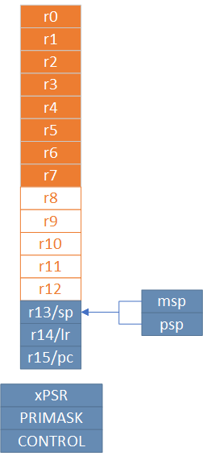

# Очень просто планировщик на примере CortexM3

Эта статья будет посвещена тому как реализовать Очень Простой Планировщик, описанный в статье аж 2006 году https://www.embedded.com/build-a-super-simple-tasker/[] и сейчас реализованный http://www.state-machine.com/products/[Quantum Leaps] в продукте http://www.state-machine.com/qpcpp/[Qp framework].

С помощью этого ядра очень просто реализовать конечный автомат, и оно очень хорошо может использоваться в небольших проектах.

В этой статье я лишь поробую показать, как можно реализовать такой планировщик самому.

## Введение

Собственно, в качестве введения наверное лучше всего подойдет цитата из выше указанной статьи 2006 года

> Большую часть времени встроенные системы ждут какого-то события, такого как тик времени, нажатие кнопки, готовности АЦП или получения пакета данных. После распознавания события системы реагируют, выполняя соответствующие вычисления. Эта реакция может включать в себя работу с аппартными модулями или создание вторичных событий бизнес логики, которые запускают другие внутренние функкции. После завершения действия по обработке событий такие  системы переходят в спящее состояние в ожидании следующего события.
{nbsp} +
Большинство RTOS для встроенных систем вынуждают программистов моделировать эти простые, дискретные реакции на события, используя задачи, разработанные как непрерывные бесконечные циклы.

Помимо сего прочего, традиционный подход, использующий такие RTOS является довольно ресурсоемким, например, сущетсвенное время необходимо для переключения контекста, для каждой зачи необходим свой стек.

В случае же с SST ядро и планировщик очень просты и ему не нужно управлять несколькими стеками. И основная фишка этого ядра является то, что оно требует чтобы все задачи задачи выполнялись до заверщения (Run to complition) в одном стеке.

Для начала немного определений для понимания, что будет происходить дальше

## CortexM0 регистры
CoretexMo имеет 16 регистров общего назначения:

* Младшие регистры (r0-r7)
* Старшие регистры (r8-r12),
* Регистр указателья стека SP (r13) для текущего контекста
** В зависимости от контекста может быть либо MSP (указателем основного стека) либо PSP ( указателем стека процесса)
* Регистр связи LR (r14)
* Регистр счетчика команд PC(r15)

И ряд регистров специального назначения:

* Регистр состояния xPSR, он содержит в себе флаги результатов выполнения арфиметических дейтвий, состояние выполнение программы и номер обрабатываемого в данный момент исключения. Доступ к полям регистра может осуществляться через три псевдорегистра, позволяющие обращаться к определенным областям xPSR:
** Регистр состояния приложения APSR содержит флаги результатов выполнения арифметических операций
** Регистр состояния прерывания EPSR содержит номер обрабатываемого исключения
** Регистр состояния выполнения IPSR содержит бит показывающий в каком режиме исполняются команды микоконтроллера Thumb или ARM, так как CortexM0 может работать только в Thumb режиме, то это бит всегда должен быть равено 1.
* Регистр PRIMASK, в нем всего один бит, запрещающий все прерывания с конфигурируемым приоритетом
* Регистр CONTROL, управлляющий выбором режима (Прилигированный или нет (для CortexM0, всегда прилигированный)) и выбором стека (главный или программный)

## Регистр указателя стека (r13/SP)

Я не буду подробно описывать что такое стек, есть множество статей на эту тему. Но для того, чтобы понять как он работает на CortexM архитектуре необходимо знать несколько моментов.

* Указатель стека используется для доступа к стеку с помощью интрукций pop и push.
* Укзатель стека может быть подифицирован с помощью инструкций  ldr, str, subs, adds и так далее
* Имеет двойное назначение и может являться:
** MSP(Main Stack Pointer) - указателем на основной стек,
** PSP (Programm Stack Pointer) - указателем на стек процесс PSP. +

Однако в каждый момент доступен только один из этих указателй. Какой именно определяется CONTROL регистром.

*  Указатель стека всегда выравнен по слову и его два младшие бита должны бть равны 0.
* Стек всегда двигает от старших адресов к младшим.

## Регистр свзязи (r14/LR)

Регистр связи используется хранения информации о возврате для подпрограмм, вызовах функций и исключений.

* Регистр используется при вызове подпрограмм и исключений обычно.
* Во время вхождения и возврата из исключения в LR записывается EXC_RETURN код, который указывает в какой режим и какой стек нужно использовать после возврата из исключения.

## Вход в прерывание

Важным моментом является понимае того, что происходит во время вхождения и выхода из прерывания.
Вход в прерывание возникает тогда, когда появляется ожидающее исключение с необходимым приортетом и :

* Микроконтроллер находится в Thread режиме
* Исключение имеет приоритет выше, чем обрабатывающееся в данный момент исключение. В таком случае исключение с высшим приоритетом вытесняет текущее исключение, по другому это называется вложенными исключениями.

Когда микроконтроллер начинает обработку исключения он сохраняет необходимую информацию в стек. Эта операция по английски называется "stacking". По русски звучит странно, поэтому не буду переводить.
Стек исключения содержит кадр из 8 слов данных и подчиняется простым правилам.
Стек выравнивнен по 8 байтову адресу (двум словам).
Стек содержит адрес возврата из сиключения  - адрес следующей инструкции в прерванной исключением подпрограмме. Это значение востанавливается и загружается в PC во время возврата из исключения.
Микроконтроллер, а точнее контроллер прерывания считывает стартовый адрес обработчика исключения из таблицы векторов прерываний.
Когда "stacking" завершен, микроконтроллер запускает выполнение обработчика прерывания. В то же время микроконтроллер запсывает специальное код возврата, называемый EXC_RETURN в регистр LR. Этот код показывает тип указателя стека (MSP или PSP) и в каком режиме был микроконтроллер до входа в исключение.

Если, во время входа в исключение не произошло более высоко-приоритетного прерывания, процессор запускает выполнение обрабочика исключения. Микроконтоллер автоматически изменяет статус исключения на активное.
Если более высокоприоритеное исключение произошло во время входа в исключение, то текущее статус текущего прерывания будет "ожидание". Так называемое "позднее прибытие".

## Возврат из исключения

Возврат из иключения происходит когда микроконтроллер находистя в Handler режиме и  выполняется одна и следующих инструкций, пытающихся установить PC в специальное EXC_RETURN значение :

  * POP инструкция которая загружает значение из стека в PC.
  * BX инструкция, сипользущая любой регистр

Микроконтроллер сохраянет значение EXC_RETURN в LR при входе в исключение
Механизм исключений полагается на это значение, чтобы определить когда микроконтроллер завершит обработку исключения.
Биты[31:4] EXC_RETURN значения должны быть установлены в 0xFFFFFFF. Когда микроконтролер загружает эти бтьы в PC, это дает понять ядру, что операция не является обычной, а означает завершение обработки прерывания. Как результат такого "оповещения" запускается последовательность возврата из исключения.
Биты[3:0] EXC_RETURN  значения указывают на требуемый стек возврата и режим процессора.

Для чего это было сделано? Идея состоит в том, чтобы PSP стек использовался отдельными задачами, а MSP стек использовался обработчиками исключений и ядром.

Когда возникает исключение, контекст задачи помещается в текущий активный указатель стека PSP, а затем переключается на использование MSP для обработки исключения.

В традиционной RTOS в момент, когда планировщик вызвал исключение , например PendSV, вы должны сохранить указатель PSP стека на текущую задачу в стеке текущей задачи, загрузить из стека следующей задачи указатель стека в PSP и возвратиться уже в новую задачу.

С одной стороны это хорошо - это подразумевает некое разделение между стеками обработчика исключений и задач, ваша задача всегда работает со стеком PSP и доступа к MSP нет.

С другой стороны, переключение контектса не такое быстрое, а из-за того, что каждая задача имеет свой стек - дополнительный расход ОЗУ.

Поэтому все тоже самое можно реализовать на одном стеке MSP. Давайте посмотрим, как это можно сделать.

## Режимы работы процессора.
Cortex-M имеет два режима работы: режим потока (Thread) и режим обработчика (Handle).
 * Режим Handle используется при обработке исключительных ситуаций(обработчики прерываний),
 * Режим Thread — для выполнения пользовательского кода.

Переключение из одного режима в другой происходит автоматически.

# Переключение контекста

[source, asm]
----
  RSEG CODE:CODE:NOROOT(2)
  PUBLIC  HandlePendSv
  PUBLIC  HandleSvc
  EXTERN  Schedule

HandlePendSv:
  CPSID   i

  LDR     r3,=0xE000ED04
  LDR     r1,=1<<27
  STR     r1,[r3]
  LDR     r3,=1<<24

  LDR     r2,=Schedule-1
  LDR     r1,=ScheduleReturn
  SUB     sp,sp,#8*4
  ADD     r0,sp,#5*4
  STM     r0!,{r1-r3}
  LDR     r0,=0xFFFFFFF9
  BX      r0

ScheduleReturn:
  CPSIE   i
  SVC #0

HandleSvc:
  ADD     sp,sp,#(8*4)
  BX      lr
  END
----

