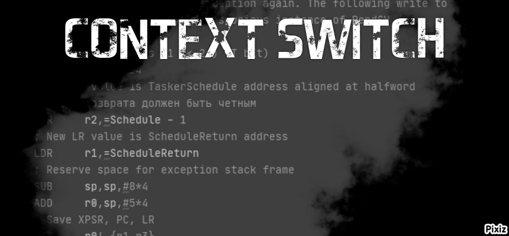
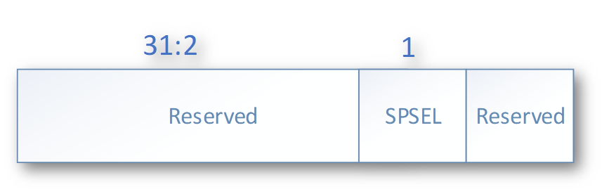
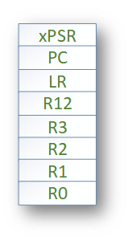
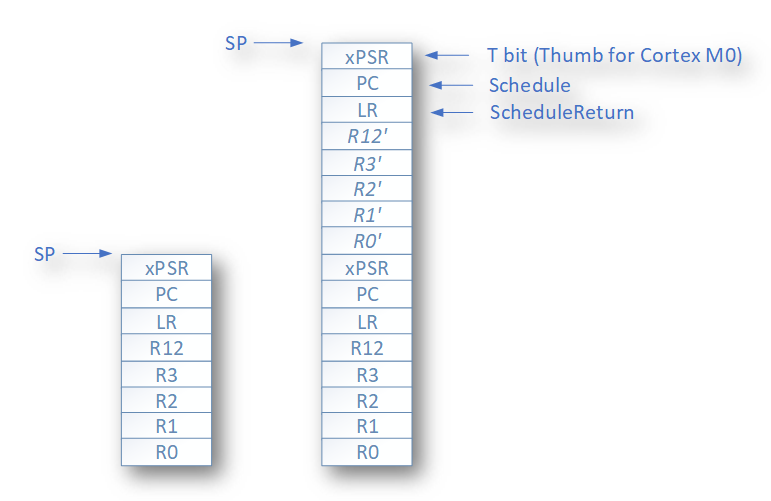
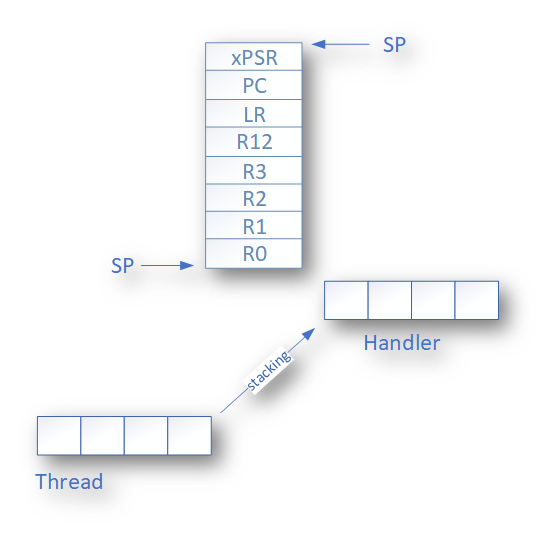
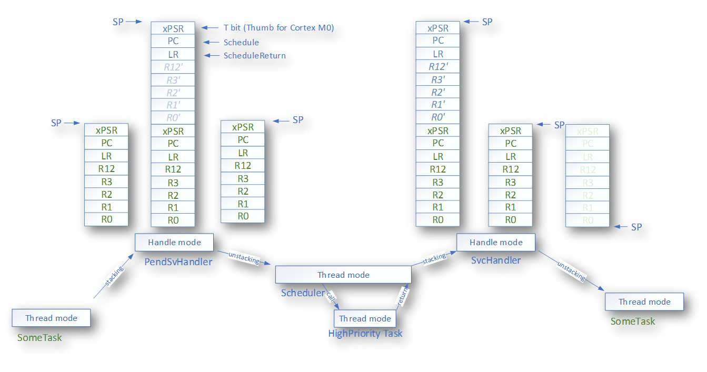

# Очень простой планировщик на примере CortexM0

С каждым годом курсовые для моих студентов становятся все объемнее. Например, в этом году, одним из заданий было - разработка метеостации, ведь только ленивый не делает метеостанции, а студенты они по определению не ленивые, поэтому должны её сделать. Её можно быстро накидать в Cube или собрать на Ардуино, но задача курсового не в этом. Основная задача - самостоятельно, с нуля разобраться с модулями микроконтроллера, продумать архитектуру ПО, и собственно закодировать все на С++.
Кому интересно, вот пример отчета по такому курсовому. FIXME

Так вот появилась небольшая проблема, а именно, бесплатный IAR позваоляет делать ПО размером не более 30 кБайт. А это уже впритык к размеру курсового в неоптимизированном виде. Я посмотрел код и выяснил, что примерно 1/5 часть занимает FreeRtos, около 6 кБайт, хотя для того, чтобы переключать задачи, наверное хватило- бы и 1-2 кБайт.

Эта статья будет посвещена тому как реализовать Очень Простой Планировщик, описанный в статье аж 2006 году https://www.embedded.com/build-a-super-simple-tasker/[] и сейчас реализованный http://www.state-machine.com/products/[Quantum Leaps] в продукте http://www.state-machine.com/qpcpp/[Qp framework].

С помощью этого ядра очень просто реализовать конечный автомат, и оно очень хорошо может использоваться в небольших проектах студентами, получив дополнительно 4 кБайта в свое распоряжение.

Я попробую показать, как можно реализовать такой планировщик самому. Чтобы не сильно перегружать статью, расмотрю переключение контекста на CortexMO у которого нет аппаратного модуля с плавающей точкой.

Кому интересно это, а также как вообще переключается контекст, добро пожаловать под кат.

----
Вы можете спросить, а зачем вообще тут RTOS - ответ прост, для обучения, для понимания, для упрощения архитектуры и самого ПО. Да и вообще
при разработке ПО под микроконтроллеры, особенно, если это что-то серьезнее, чем моргание светодоидом, часто приходится иметь дело с многоздачностью.
А еще также часто приходится обеспечивать как можно более быстрый отклик на некоторые события, например, истечение таймера, прерывание от аппаратного модуля, прием данных и так далее. По другому это называется обеспечивать режим реального времени.

И вот для этого(и не только для этого) программисты встроенного ПО используют Операционные системы реального времени, типа FreeRTOS. И это хорошо, но бывает так, что использование операционной системы влечет за собой необоснованный расход ресурсов микроконтрллера (ОЗУ - ведь каждая задача требует свой стек, поднятие частоты процессора из-за медленного переключения контекста, ПЗУ - такие RTOS универсальны и иногда подключается куча ненужных для вашей скромной задачи сервисов).
----

## Введение

Собственно, в качестве введения наверное лучше всего подойдет цитата из выше указанной статьи 2006 года

> Большую часть времени встроенные системы ждут какого-то события, такого как тик времени, нажатие кнопки, готовности АЦП или получения пакета данных. После распознавания события системы реагируют, выполняя соответствующие вычисления. Эта реакция может включать в себя работу с аппартными модулями или создание вторичных событий бизнес логики, которые запускают другие внутренние функкции. После завершения действия по обработке событий такие  системы переходят в спящее состояние в ожидании следующего события.
{nbsp} +

Большинство RTOS для встроенных систем вынуждают программистов моделировать эти простые, дискретные реакции на события, используя задачи, разработанные как непрерывные бесконечные циклы.

По большому счету, вся программа  - это один большой или небольшой конечный автомат. И наши старшие братья в мире ПО под "нормальные" операционные системы давно уже имеют кучу механизмов для реализации конечных автоматов - потоки, корутины, фиберы - тому поддверждение. В ПО же для микроконтроллеров же каждый раз приходится либо использовать совсем неоптимальные вещи обычных операционных систем реального времени (передача событий от задачи к задаче, со всеми вытекающими (долгие переключения контеста, создание новых задач с большими стеками)), либо городить что-то свое, либо по старинке пользоваться обычным switchом.

В случае же с SST ядро и планировщик очень просты и ему не нужно управлять несколькими стеками. И основное отличие этого ядра является то, что оно требует чтобы все задачи выполнялись до заверщения (Run to completion), используя один стек.
А это кстати решает одну из вечных проблем - бесконечный цикл в С++ это вообще-то UB. Уберем их - и не будет UB, заодно сделаем наш планировщик без единого указателя, чтобы вообще ни один UB не проник в код (не уверен, что код на С++ можно вообще написать без UB, а вдруг выйдет?).

Но перед тем как начать рассказ, я хотел вначале найти простое объяснение, как переключить контекст в интернете, из более менее понятного - простого, это вот https://www.kit-e.ru/assets/files/pdf/2013_04_168.pdf. Но понять принцип переключения при первом чтении без заглядывания в руководство по ядру CortexM3 из этого текста не так просто.

Есть еще статья на Хабре: https://habr.com/ru/company/embox/blog/330236/[Как сделать context switch на STM32].
Но даже если вы и прочитали эту статьи, то все равно, это выглядит как рисование совы.

Поэтому давайте вначале разберемся с алгоритмом переключения контекста, как это вообще происходит. И первым делом займемся изучением некоторых понятий

## Команды CortexM микроконтроллеров
У CortexM бывает три набора команд:

* *ARM* - Основной набор 32 битный набор команд.
* *Thumb* — Cокращённая система 16 битных команд.
* *Thumb-2* - 16 битный thumb набор + немного 32 битных команд, эдакая смесь *ARM* и *Thumb*, чтобы получить преимущества обоих систем команд.

Так вот наш CortexM0 поддерживает только *Thumb* набор, ну не считая парочки команд из *Thumb-2* - закроем на это глаза.
На всякий случай, CortexM3 поддерживает *Thumb-2* полностью.

## Режимы работы процессора.
Cortex-M имеет два режима работы: режим процесса (*Thread*) и режим обработчика (*Handle*):

* Режим *Handle* используется при обработке исключительных ситуаций(обработчики прерываний) и работает только с основным *MSP* стеком
* Режим *Thread* — для выполнения пользовательского кода и может работать с осноснвым стеком(*MSP*) или стеком процесса (*PSP*)
Переключение из одного режима в другой происходит автоматически.

Про стеки узнаем немного позже, а пока это вся информация по режимам, которую нужно знать для переключения контекста.

## CortexM0 регистры
CortexM0 имеет 16 регистров общего назначения:

image::Img/registers.png[]

* Младшие регистры (r0-r7)
* Старшие регистры (r8-r12),
* Регистр указателья стека *SP* (r13) для текущего контекста
** В зависимости от контекста может быть либо *MSP* (указателем основного стека) либо *PSP* ( указателем стека процесса)
* Регистр связи *LR* (r14)
* Регистр счетчика команд *PC*(r15)

И ряд регистров специального назначения:

* Регистр состояния *xPSR*, он содержит в себе флаги результатов выполнения арфиметических дейтвий, состояние выполнение программы и номер обрабатываемого в данный момент исключения. Доступ к полям регистра может осуществляться через три псевдорегистра, позволяющие обращаться к определенным областям *xPSR*:
** Регистр состояния приложения *APSR* содержит флаги результатов выполнения арифметических операций
** Регистр состояния прерывания *EPSR* содержит номер обрабатываемого исключения
** Регистр состояния выполнения *IPSR* содержит бит показывающий в каком режиме исполняются команды микоконтроллера *Thumb* или *ARM*, а так как, мы выяснили, что CortexM0 может работать только в *Thumb* режиме, то это бит всегда должен быть равено *1*, иначе микроконтроллер допустит недопустимое.
* Регистр *PRIMASK*, в нем всего один бит, запрещающий все прерывания с конфигурируемым приоритетом
* Регистр *CONTROL*, управляющий выбором режима (Прелигированный или нет(Это еще что такое? Да сколько этих режимов?, не волнуйтесь,  для CortexM0 режим всегда прилигированный, поэтому просто не обращайте на это внимаение)) и выбором стека (основной *MSP* или стек процесса *PSP*)

## Регистр указателя стека (r13/SP)

Я не буду подробно описывать что такое стек, есть множество статей на эту тему. Но для того, чтобы понять как он работает на CortexM архитектуре необходимо знать несколько моментов.

* Указатель стека всегда выравнен по слову и его два младшие бита должны быть равны 0.
* Стек всегда двигает от старших адресов к младшим.
* Указатель стека используется для доступа к стеку с помощью интрукций *POP* и *PUSH*.
* Укзатель стека может быть подифицирован с помощью инструкций  *LDR*, *STR*, *SUB*, *ADD* и так далее
* Имеет двойное назначение и может являться:
** *MSP*(Main Stack Pointer) - указателем на основной стек,
** *PSP* (Programm Stack Pointer) - указателем на стек процесс PSP. +

Однако в каждый момент доступен только один из этих указателй. В режиме *Handle* указатель *SP* всегда указывает на *MSP*, а вот в режиме *Thread* указатель может указывать как на основной стек *MSP*, так и на стек процесса *PSP*. Как именно сейчас стек используется, можно определить с помощью CONTROL регистра.

Выходя из режима *Handle* можно поменять стек указав волшебное значение в регистре связи. Встречаем регистр связи.

## Регистр свзязи (r14/LR)

У регистра связи две функции. Одна прямая - хранение адреса возврата:

* Регистр связи используется хранения адреса возврате из подпрограмм и функций, вызванных командой BL.

И вторая не менее важная:

* Во время входа и возврата из исключения в LR сохраняется EXC_RETURN код, который указывает в какой режим и какой стек нужно использовать после возврата из исключения.

|===
|EXC_RETURN |Что значит

|0xFFFFFFF1
|Возвращаемся в *Handle* режим, используем основной стек *MSP*

|0xFFFFFFF9
|Возвращаемся в *Thread* режим, используем основной стек *MSP*

|0xFFFFFFFD
|Возвращаемся в *Thread* режим, используем стек процесса *PSP*

|===

## CONTROL регистр

Нам не нужен этот этот регистр, так как будем использовать всегда основной стек, но для понимания отличий с обычными RTOS, необходимо сказать несколько слов про этот регистр.

Используя этот регистр можно вы можете задать режим переключения стеков. Задав 1, в поле SPSEL - можно быть уверенным, что в режиме процесса (Thread mode) будет использоваться стек процесса PSP.

[horizontal]
Bit 1: SPSEL::   Определяет, какой стек будет использоваться::
* *0*: Текущий стек всегда будет основной стек (SP_main).
* *1*: В режиме Thread mode, текущий стек будет стек процесса (SP_process). В Handle mode используется всегда основной стек

Переключение контеста в обычных операционных системах происходит имеено c установкей SPSEL в 1, как только вы выходите из обработчика прерывания (Handle mode) и попадаете в режим процесса (Thread), основной стек переключается на стек процесса. И все что вам нужно для переключения контектса - это, сохранить контекст одной задачи, правильно инициализировать указатель стека psp на новую задачу и востановить её контекст.

Ну да ладно, мы то его использовать не будем и все сделаем на основном стеке.

## Program Status Register (PSR)

## Кадр исключения
Для полноты картины нехватает еще одного понятия - Кадр исключения (Exception Frame). Так вот, это набор регистров, которые автоматически сохраняются при входе в Исключение и восстанавливается из него при выходе из исключения. Кадр выглядит как - то так:

Сохраняются регистры R0-R3, R12 и LR, PC, xPSR.

## Прерывания

## Вход в Исключение

Важным моментом является понимае того, что происходит во время вхождения и выхода из прерывания.
Вход в прерывание возникает тогда, когда появляется ожидающее исключение с необходимым приортетом и:

* Микроконтроллер находится в *Thread* режиме
* Исключение имеет приоритет выше, чем обрабатывающееся в данный момент исключение. В таком случае исключение с высшим приоритетом вытесняет текущее исключение, по другому это называется вложенными исключениями.

Когда микроконтроллер начинает обработку исключения он сохраняет кадр исключения в стеке. Эта операция по английски называется "stacking". По русски звучит странно, поэтому не буду переводить. При этом указатель стека перемещается на размер кадра исключения.

Стек исключения содержит кадр из 8 слов данных и подчиняется простым правилам.

Стек выравнивнен по 8 байтову адресу (двум словам).

Стек содержит адрес возврата из исключения  - адрес следующей инструкции в прерванной исключением подпрограмме. Это значение востанавливается и загружается в PC во время возврата из исключения.

Микроконтроллер, а точнее контроллер прерывания считывает стартовый адрес обработчика исключения из таблицы векторов прерываний.
Когда "stacking" завершен, микроконтроллер запускает выполнение обработчика прерывания. В то же время микроконтроллер записывает специальный код возврата - EXC_RETURN в регистр *LR*, как мы уже выяснили этот код показывает тип указателя стека (*MSP* или *PSP*) и в каком режиме был микроконтроллер до входа в исключение.

Если во время входа в исключение не произошло более высоко-приоритетного прерывания, процессор запускает выполнение обрабочика исключения. Микроконтоллер автоматически изменяет статус исключения на активное.
Если более высокоприоритеное исключение произошло во время входа в исключение, то текущее статус текущего исключения будет "ожидание". Так называемое "позднее прибытие".

## Возврат из исключения

Возврат из иключения происходит когда микроконтроллер находистя в Handler режиме и  выполняется одна и следующих инструкций, пытающихся установить PC в специальное EXC_RETURN значение :

  * POP инструкция которая загружает значение из стека в PC.
  * BX инструкция, сипользущая любой регистр

Микроконтроллер сохраянет значение EXC_RETURN в LR при входе в исключение
Механизм исключений полагается на это значение, чтобы определить когда микроконтроллер завершит обработку исключения.
Биты[31:4] EXC_RETURN значения должны быть установлены в 0xFFFFFFF. Когда микроконтролер загружает эти бтьы в PC, это дает понять ядру, что операция не является обычной, а означает завершение обработки прерывания. Как результат такого "оповещения" запускается последовательность возврата из исключения.
Биты[3:0] EXC_RETURN  значения указывают на требуемый стек возврата и режим процессора.

При возврате из исключения происходит обратная операция - unstacking, еще более странно переводящаяся на русский язык. При этом микроконтроллер считывает сохраненные ....

Залипающая картинка

Для чего это было сделано? Идея состоит в том, чтобы PSP стек использовался отдельными задачами, а MSP стек использовался обработчиками исключений и ядром.

Когда возникает исключение, контекст задачи помещается в текущий активный указатель стека PSP, а затем переключается на использование MSP для обработки исключения.

В традиционной RTOS в момент, когда планировщик вызвал исключение , например PendSV, вы должны сохранить указатель PSP стека на текущую задачу в стеке текущей задачи, загрузить из стека следующей задачи указатель стека в PSP и возвратиться уже в новую задачу.

С одной стороны это хорошо - это подразумевает некое разделение между стеками обработчика исключений и задач, ваша задача всегда работает со стеком PSP и доступа к MSP нет.

С другой стороны, переключение контектса не такое быстрое, а из-за того, что каждая задача имеет свой стек - дополнительный расход ОЗУ.

Поэтому все тоже самое можно реализовать на одном стеке MSP. Давайте посмотрим, как это можно сделать.

# Переключение контекста

[source, asm]
----
  RSEG CODE:CODE:NOROOT(2)
  PUBLIC  HandlePendSv
  PUBLIC  HandleSvc
  EXTERN  Schedule

HandlePendSv:             // попадая в прерывание микроконтроллер сохранит exception frame

  LDR     r3,=0xE000ED04  // Загружаем адрес регистра ICSR
  LDR     r1,=1<<27       // Устанавливаем бит сброса флага прерывания PendSV

  CPSID   i              // Запрещаем прерывание

  STR     r1,[r3]        // Очищаем флаг прерывания PendSV в регистре ICSR
  LDR     r3,=1<<24      // устанавливаем T-bit,  который индицирует, что процессора находится в Thumb state. Наше едро работает только с набором команда Thumb, если он будет в 0, возникнет ошибка

  LDR     r2,=Schedule-1         //загружаем адрес планировщика - он должен быть четным
  LDR     r1,=ScheduleReturn     //и адрес возврата
  SUB     sp,sp,#8*4             //резервируем на стеке место под exception frame
  ADD     r0,sp,#5*4             //и перемещаемся в место для сохранения XPSR, PC, LR
  STM     r0!,{r1-r3}            // и сохраняем их r3- xPSR, R2 - PC, r1-LR
  LDR     r0,=0xFFFFFFF9         // Возрвращаемся в thread Mode из MSP стека в MSP стек
  BX      r0

ScheduleReturn:
  CPSIE   i                    //возвращаемся из планировщика, разрешаем прерывания
  SVC #0                       // И инициируем преываение SVC для возврата в поток, который превало PendSV

HandleSvc:
  ADD     sp,sp,#(8*4)        //Удаляем место под exception frame, нам он больше не нужен, используем exception frame от PendSV
  BX      lr                  //возвращаемся к прерваному потоку.
  END
----

## Планировщик

Для простоты, мы сделаем так, чтобы приоритет задач определялся её положением в списке задач Очень простого планировщика. Ну т.е., чтобы если мы задали бы так

[source, cpp]
----
struct myTasker: Tasker<HighPriorityTask, NormalPriorityTask, LowPriorityTask,  idleTask> {} ;
----

То это бы означало, что приоритет HighPriorityTask -  самый высокий, а idleTask - самый низкий. Это нам решит кучу проблем, с сортировкой списка задач. Задачи всегда расположены в порядке уменьешения приритета.

Тогда наш планировщик будет совсем совсем простым.

[source, cpp]
----
  static void Schedule()
  {
    if(preempted)
    {
      preempted = false;
      const tTaskId preemptedTaskId = activeTaskId;
      auto nextTaskId = GetFirstActiveTaskId();

      // Если номер задачи меньше номера текущей задачи,
      // то у неё выше приоритет и её надо запустить
      while (nextTaskId < activeTaskId)
      {
        activeTaskId = nextTaskId;
        CallTask(nextTaskId); // вызываем задачу и сбрасываем установленное событие
        nextTaskId = GetFirstActiveTaskId(); // вдруг есть еще активные задачи
      }
      activeTaskId = preemptedTaskId;
    }
  }
----

Так че там мы еще хотели - хотели же стейт машину, чтобы просто можно было делать. А для этого надо нацчиться сигналить задачам.. Ну ок.

[source, cpp]
----
 template<const auto& targetTask>
 static void PostEvent(const tStateEvents events)
 {
   const CriticalSection cs;
   targetTask.events |= events; //послали событие задаче
   preempted = true;
   Schedule(); //Вдруг задача, которой мы послали событие выскоприоритетная и надо её выполнить.
 }
----

Нельзя просто так взять и запустить планировщик из прерывания, нужно из этого прерывания как-то выйти вначале, а потом уже запустить - и это мы делаем путем вызова PendSV.

[source, cpp]
----
 __forceinline static void IsrEntry()
 {
   assert(scheduleLockedCounter != 255U);
   ++scheduleLockedCounter;
 }

 __forceinline static void IsrExit()
 {
   assert(scheduleLockedCounter != 0U);
   --scheduleLockedCounter;
   SCB::ICSR::PENDSVSET::PendingState::Set(); //
 }
----

